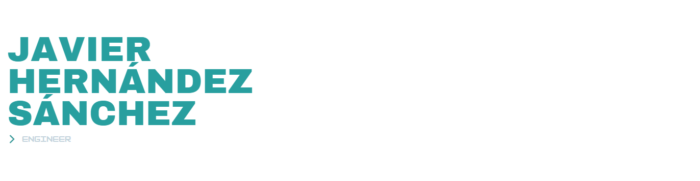

<header> 
<picture>
<source media="(prefers-color-scheme: light)" srcset="./assets/github-header-image.png">
<source media="(prefers-color-scheme: dark)" srcset="./assets/github-header-image-dark.png">

</picture>

</header>

## About me

CEO and Founder of [spacetimewave](https://github.com/spacetimewave) and [trustnet](https://github.com/spacetimewave/trustnet-engine) contributor. Software engineer with MSc and Bachelor degree in Telecommunications Engineering. Driven by a passion for science and technology, I am dedicated to pushing the boundaries of AI, blockchain, cryptography, and quantum computing. Open-Source advocate.

Please, check out my [resume](https://github.com/javierhersan/javierhersan/blob/main/assets/CV_Javier_Hernandez_jan2024-eng.pdf) for more details.

<a href = "https://github.com/javierhersan/javierhersan/blob/main/assets/CV_Javier_Hernandez_jan2024-eng.pdf"></svg></a>

## Technologies

  
  
  
   
  
   
  
  
  
  
      
       
  
  
  
  
  
  
  
  
  
  
  
  
  
  
  
  
  
  
  
  
  
  
  
        
  
  
  
  
  
  

